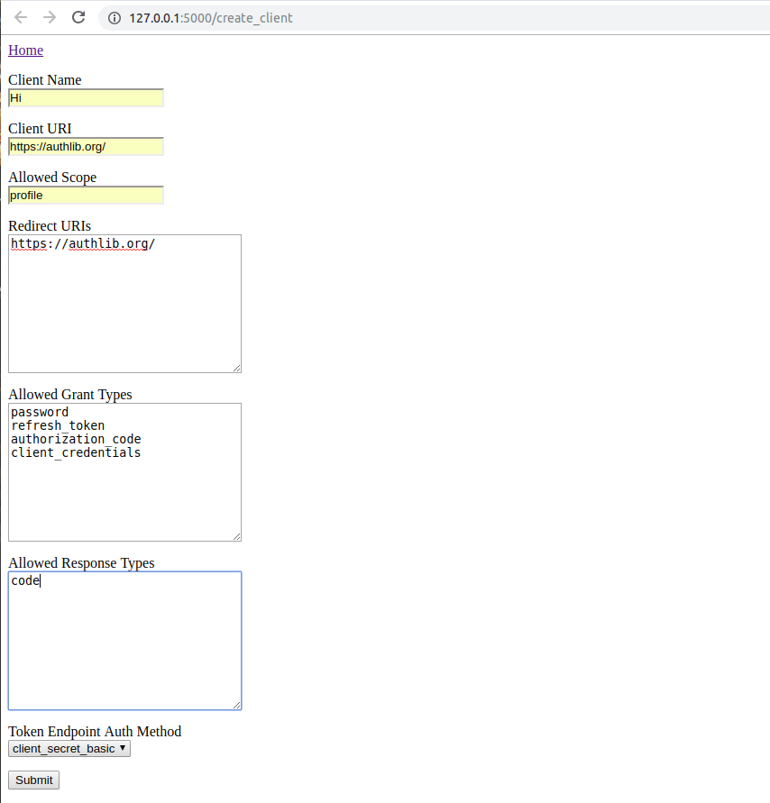

# OAuth 2.0 Provider
This is an example of OAuth 2.0 server in [Authlib](https://authlib.org/).
If you are looking for old Flask-OAuthlib implementation, check the
`flask-oauthlib` branch.

- Documentation: <https://docs.authlib.org/en/latest/flask/oauth2.html>
- Authlib Repo: <https://github.com/lepture/authlib>

# Modified 
- arrik

# docs
- https://documenter.getpostman.com/view/2777668/RzZ4pgqL

# images

# original repo
https://github.com/authlib/example-oauth2-server

# running app
see this post >> https://github.com/authlib/example-oauth2-server

## License

Same license with [Authlib](https://authlib.org/plans).
